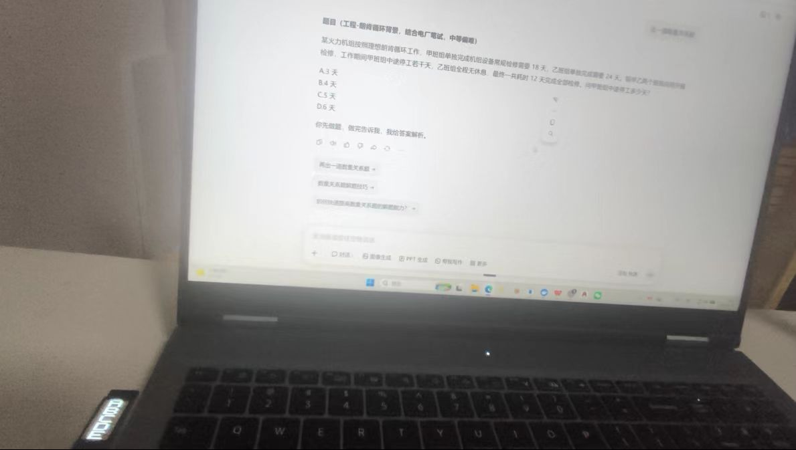

# EasyConnectStar PC-only

> 后续使用反馈 QQ 群：`1121057957`

独立 PC 端截图识别工具的公开发布版。它提供桌面截图、云端视觉问答、鼠标截图暂存、悬浮窗和 MSU2 外接小屏答案显示功能。

## 使用效果展示

电脑端截图识别后，答案可同步显示在外接 MSU2 小屏上：



## 可选中转服务入口

下面的链接是可选服务入口，不是软件强制依赖。前两个为注册入口；后两个可按站点规则签到领取使用额度。API 地址、模型和 API Key 均需要在软件中自行配置，本仓库不包含任何 API Key。

- [大达 API 注册](https://api.dadakeji.com/register?aff=HFLZVG6DPQHM)
- [ModelVerse 注册](https://modelverse.top/register?aff=ZPPWGSLK3EM3)
- [AIAIAI 注册/签到](https://api.aiaiai001.com/sign-up?aff=zQ6U)
- [SheAPI 注册/签到](https://www.sheapi.top/sign-up?aff=3yhq)

## 下载

- [下载 EasyConnectStar-PCOnly.exe](./EasyConnectStar-PCOnly.exe)
- [下载彻底退出脚本](./Close-EasyConnectStar-PCOnly.bat)

文件 SHA-256：

```text
C85935EE3C7D1C12978B5470F21CF81913142B377D02D5E8F23ACBCA4AAAA09E
```

## 运行前提

- Windows 10/11 64 位系统优先。
- 需要 Windows 的 .NET Framework 4.x，建议安装 4.8 或更高兼容版本。多数正常 Windows 10/11 已自带，但精简系统不一定有。
- 第一次运行建议把 EXE 放在有写入权限的普通文件夹中，不要直接放在受保护的系统目录。
- 程序会在 EXE 同目录创建配置、日志和 `captures` 截图目录。

当前发布的是 PC-only 可执行文件。PC 模式的正常路径使用 Windows 截图、网络请求、悬浮窗和串口功能；它不需要用户配置移动端 API，也不会把默认 API Key 写入程序。当前构建仍保留面试模块的编译依赖，因此如需重新编译或运行其他模式，请使用完整工程目录，而不是只复制 EXE。

## 启动与退出

1. 双击 `EasyConnectStar-PCOnly.exe`。
2. 程序启动后默认进入 PC 端模式。
3. 点击窗口关闭按钮时，窗口会隐藏，后台进程继续运行；需要真正退出时使用界面中的“彻底退出”。
4. 如果窗口已经隐藏，双击 `Close-EasyConnectStar-PCOnly.bat` 可以结束当前电脑上所有同名 PC-only 进程。脚本只匹配 `EasyConnectStar-PCOnly.exe`，不会结束综合版 `EasyConnectStar.exe`。

## API 配置

1. 在 API 配置区域点击“新增”。
2. 填写 API 名称、Base URL、API Key 和模型名称。
3. 新建条目的 Base URL 默认是 `https://api.dadakeji.com/v1`，但仍可以修改。
4. 选择推理强度、超时时间、优先级和启用状态后点击“保存配置”。
5. “获取模型”用于读取服务端提供的模型列表；“测试 API”会截取当前桌面并进行一次视觉问答测试，不是单纯的文本连通性测试。
6. 可以启用多个 API，并通过优先级选择“优先级回答”或使用全部已启用 API 的回答模式。
7. API 配置支持导入和导出。导出的配置包含本机保护后的密钥信息，不要上传到公开仓库或发送给他人。

软件初始 API 列表为空，不内置默认 Key 和默认模型。API Key 只应填写自己的服务密钥。

## 单张截图识别

1. 在“截图与快捷键”区域选择目标显示器。
2. 使用截图模式下拉框选择“框选截图区域”或“自动框选”。
3. 框选模式下启用“指定截图区域”后，点击区域选择按钮，在目标桌面上拖动选择题目区域；未选择区域时使用完整屏幕。
4. 自动框选模式会先获取全屏，再使用内置题目区域检测逻辑生成识图区域。
5. 默认快捷键为 `Ctrl + Shift + Q`，可以重新选择修饰键和字母后点击“应用”。
6. 按快捷键后，程序会截取目标桌面、调用当前 API 配置并显示回答。

截图时程序会暂时避开自身窗口，避免把 EasyConnectStar 界面截进题目图片。

## 鼠标截图与多图识别

打开“鼠标截图”后：

- 鼠标中键：暂存一张截图，不立即调用 API，最多暂存 5 张。
- 鼠标左键快速双击：提交当前暂存的多张图片并按顺序调用 API。
- 如果没有暂存图片，左键快速双击会按单图模式直接截图识别。
- 识别进行中重复触发无效，避免并发请求和答案覆盖。
- 多图结果按题目顺序显示，例如 `第1题：A，第2题：C`；多选题使用 `第1题：A、C`。
- 成功提交后会清空暂存列表；失败时会保留暂存图片，方便重试。

中键监听不会阻止系统继续处理普通中键操作；是否启用该功能由“鼠标截图”开关控制。

## 悬浮窗

点击“悬浮窗：开/关”即可显示或隐藏答案悬浮窗。悬浮窗会在回答完成后更新当前结果，也可以在识别过程中关闭，不影响截图和 API 请求。

## MSU2 外接小屏

小屏购买参考：[拼多多 MSU2 小屏购买链接](https://mobile.yangkeduo.com/goods2.html?ps=Iz8hEzlhXu)

连接 MSU2 小屏后：

1. 勾选“屏幕显示正确选项”。
2. 点击“扫描 COM 口”，从列表选择实际端口。
3. 点击测试按钮确认屏幕能显示 `ABCDE`。
4. 使用旋转按钮在 `0° / 90° / 180° / 270°` 之间切换，设置会保存并在下次启动时恢复。

回答成功后，程序会解析最终回答中的 A-E 选项并发送到 MSU2；解析不到标准选项时会保留上一条显示，避免把错误文本写入小屏。

## 截图预览和日志

- “测试截图”会生成当前截图并刷新预览，同时可按设置生成题目裁剪图。
- “打开截图目录”会打开程序目录下的 `captures` 文件夹。
- 运行日志会记录截图、API 调用、MSU2 更新和错误信息；“清空”只清空界面日志，不删除已保存的截图。
- 程序最多保留最近 50 组保存截图，旧截图会按组清理。

## 常见问题

## 后续使用反馈

PC 端后续使用情况、问题反馈和功能建议可加入 QQ 群：`1121057957`

### 双击没有反应

确认“鼠标截图”已经开启，并确认当前没有 API 请求正在执行。多图模式必须先用中键暂存图片；没有暂存图时才会走单图识别。

### API 测试失败

检查 Base URL 是否包含正确的 `/v1` 路径、API Key 是否有效、模型是否支持图片输入，以及网络是否能访问服务商地址。部分服务商的模型列表接口和视觉问答接口能力不同，应以服务商文档为准。

### 程序无法启动

先确认目标电脑安装了 .NET Framework 4.8 或更高兼容版本，并把 EXE 移到有写入权限的目录。若仍然失败，查看 EXE 同目录的 `pc_connector_startup.log`。

## 发布范围

本仓库当前发布可执行文件和使用说明，未上传本机 API 配置、截图、访问令牌或其他个人数据。公开仓库中的服务商链接仅作为可选入口，使用服务时请遵守对应平台的条款和适用法律法规。
